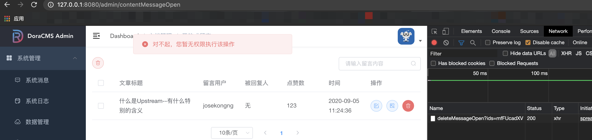

# DoraCMS

基于[DoraCMS](https://github.com/doramart/DoraCMS)进行二次开发。

## 新增和优化

新增功能：

1. 开放式留言模块
   1. 即便用户不注册也有留言权限
   2. 管理后台可使用UEditor操作留言
   3. 管理员添加用户功能
2. 文档操作
   1. 更新文档时不再跳转页面。以便能够多次更新。
   2. 编辑页面可刷新标签和分类。
   3. 将文章封面图依赖的外部请求拉到本地（有限的时间，杂乱的代码）。
   4. 新增导航链接项。可为每篇文章添加导航链接栏
   5. 用户能直接在文章列表前往新增开放式留言页面
3. 新增了一份极简模板zlpost，干净到极致
4. 管理员登录界面背景图也拉到了本地
5. 行业潜规则
   1. 可以自定义留言
   2. 可以自定义留言点赞数
   3. 可以自定义文章点赞数和阅读量

优化内容：

1. 隐藏了文件上传
2. 隐藏了站点消息
3. 隐藏了系统消息
4. 删除了模板市场。外部依赖并不完美
5. 删除了app版本。客户并不需要
6. 删除了广告管理。此功能似乎未完成
7. 删除了扩展管理
8. 添加开放留言插件

错误修复：

1. 修正了富文本编辑器UEditor插件的在线图片显示问题
2. 修正了用户管理无法搜索用户的问题
3. 修正了定时右键重复显示搜索用户的问题

希冀，但无时间去实现的目标：

1. 管理员有权关闭开放留言功能
2. 举报留言
3. 审核留言

## 开发环境

nodejs(v12.13.0) + mongodb(v4.0.16) + [nunjucks模板引擎](http://mozilla.github.io/nunjucks/)

[开发环境搭建教程](https://www.doracms.com/backend/dev/)

## 模板目录

规则代码`/app/extend/helper.js`里的`checkTempUnzipSuccess`方法描述此模块必需资源如下：

* `/tempconfig.json`
* `/dist`目录
* `/public`目录
* `/index.html`

都是相对于根目录。

## 功能阅读

HTML标签class中的一大串css与[modernizr](http://modernizr.cn/)框架有关。

nunjucks与`/app.js`与`/app/bootstrap/tags.js`有关。

### Logo修改

将`/app/public/favicon.ico`文件替换成你想要的logo

### 数据备份

数据备份需确保下载了[database-tools](https://www.mongodb.com/try/download/database-tools)工具，并将工具里的文件放到`mongodb`的`bin`目录中。

### 上传目录

七牛文件上传目录修改`/backstage/publicMethods/settings.js`配置。

### remote

除了基本的用法外：

变量名 | 默认值 | 备注
-- | -- | --
key | - | 定义接收数据参数
api | - | 获取数据的接口
query | - | 接口请求携带的参数
isPaging | - | 是否分页

```text


<a href="/tag/{{tagItem.name}}" target="_blank">{{tagItem.name}}</a>

```

还可以使用nunjucks的变量。

get请求：

```text


```

post请求：

```text


```

### 缓存清理

上传文件目录在`/app/public/upload`，按需删除，删除请谨慎（最好先备份到本地）。
数据备份目录在`/databak`，按需删除，删除请谨慎（最好先备份到本地）。

### 后台页面安装

发布时修改`package.json`端口，注意不要与其他项目冲突：

```json
{
   "scripts": {
      "serve": "vue-cli-service serve --port 你的端口号",
      "build": "vue-cli-service build"
   }
}
```

在`/backstage/build`目录运行命令。也可单独编译然后手动移动编译结果到`/backstage/dist`目录下对应的目录：

```shell
yarn buildPrdModules
# 或者
yarn buildDevModules
yarn installModules
```

在`/config/config.default.js`添加：

```js
{
   // doraContentMessageOpenPluginBegin
   contentMessageOpenRouter: {
      match: [ctx => ctx.path.startsWith('/manage/contentMessageOpen'), ctx => ctx.path.startsWith('/api/contentMessageOpen')],
   }
   // doraContentMessagePluginEnd
}
```

若在`/config/config.local.js`里启动了模块测试，则需前往对应项目中启动其服务。

如开启`contentMessageOpen`时，去`/backstage/contentMessageOpen`目录启动启动：`yarn serve`

### ueditor插件配置修正

修改插件根目录下`.html`文件：

```html
<script type="text/javascript" src="../internal.js"></script>
<script src="../../ueditor.config.js"></script>
```

修改插件根目录下`.js`文件：

```js
getOpt = function (key) {
   const config = window.UEDITOR_CONFIG
   if (config) {
      return config[key] || editor.getOpt(key)
   } else {
      return editor.getOpt(key)
   }
}
```

最后将此JS文件中的所有`editor.getOpt`调用方式替换为`getOpt`。

## 插件开发流程

1. 编写插件
2. 修改config/plugin.js
3. 热部署模式config/config.*.js

## 故障处理方式

### 无权限访问页面

“对不起，您暂无权限执行该操作”。一般是赋权问题，在`http://127.0.0.1:8080/admin/adminGroup`链接看一下有没有给角色赋权，如果找不到该权限，可以试图添加。

这里注意将`127.0.0.1:8080`替换成你的服务器地址。

下载安装并运行`Chrome`浏览器，按`F12`打开控制台：



在链接中找到返回权限不足的链接：


并在Headers中找到请求地址，将其中`manage/`后面到`?`前面（或到最后）的链接复制，这里是`contentMessageOpen/deleteMessageOpen`：


来到资源管理，到对应的资源目录`http://127.0.0.1:8080/admin/adminResource`，添加相应资源，比如我们是在开放式留言一栏进行的操作，所以在此栏目添加。

点击添加按钮，输入对应的信息后点击保存：


来到角色管理，为对应角色赋权，这里赋权给超级管理员：


登录该角色即可愉快得使用啦。

### 无权限查看该文章

只有审核通过的文章才能被查看

### 模板版本不适用

如果没导入，将模板根目录下的`tempconfig.json`文件中的版本号修改到对应的版本号，再导入即可。

如果已导入，那么需要修改数据库表`contenttemplates`中的`version`数据
